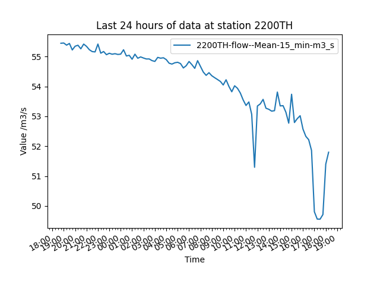

# UK Flood Monitoring Data Analysis

## Overview
This project fetches and analyzes flood monitoring data from the UK Environment Agency's API. Users can select a station, filter data for the last 24 hours, and visualize the measurements.

## API source
API Source
This project uses the UK Government's Flood Monitoring API:

- Base API URL: https://environment.data.gov.uk/flood-monitoring/id/stations

## Requirements

- Python 3.x
- pandas
- matplotlib
- PyQt5
- requests
- tabulate

## Installation

1. Clone the repository:
    ```bash
    git clone https://github.com/KevinBeeson/CMCL_technical_test
    cd CMCL_technical_test
    ```

2. Create a virtual environment (recommended):
    ```bash
    python -m venv CMCL
    ```

3. Activate the virtual environment:
    - On Linux:
        ```bash
        source CMCL/bin/activate
        ```
    - On Windows:
        ```bash
        ./CMCL/scripts/activate
        ```

4. Install the required packages:

    ```bash
    pip install pandas tqdm matplotlib PyQt5 requests tabulate
    ```
    
    or:
    
    ```bash
    pip install -r requirements.txt
    ```
## Features
- Fetches live flood monitoring station data
- Allows user selection of a station based on parameters like town or river name
- Supports filtering and visualisation of specific measurement types
- Plots the last 24 hours of data using Matplotlib

## Example run

To run the program use the following command:
```bash
 python water_level.py 
```
The program will then fetch all the names of the stations and the user can start narrowing down the data base to their wanted water station or just select a water station.
```
INFO:root:Getting all the stations
INFO:root:Successfully got stations
INFO:root:Displaying the first 20 stations
INFO:root:
|    | id_name   | town               | catchmentName                                      | riverName        | label                   |
|---:|:----------|:-------------------|:---------------------------------------------------|:-----------------|:------------------------|
|  0 | 1029TH    | Little Rissington  | Cotswolds                                          | River Dikler     | Bourton Dickler         |
|  1 | E2043     | Surfleet Seas End  | Welland                                            | River Glen       | Surfleet Sluice         |
|  2 | 52119     | Kingsbury Episcopi | Parrett, Brue and West Somerset Streams            | River Parrett    | Gaw Bridge              |
|  3 | E21136    | Hemingford Grey    | Upper and Bedford Ouse                             | River Great Ouse | Hemingford              |
|  4 | 2067      | Swindon            | Worcestershire Middle Severn                       | Smestow Brook    | Swindon                 |
|  5 | 48143     | Penryn             | Fal and St Austell Streams                         | Praze Stream     | Penryn Trelawney Park   |
|  6 | 720215    | Bilsborrow         | Lune and Wyre                                      | River Brock      | A6 Bridge               |
|  7 | F1906     | Netherside Hall    | Wharfe and Lower Ouse                              | River Wharfe     | Netherside Hall         |
|  8 | E8266     | Ardingly           | Ouse                                               | River Ouse       | Ardingly                |
|  9 | 1771TH    | Letcombe Regis     | Vale of White Horse                                | Letcombe Brook   | Letcombe Regis          |
| 10 | 531118    | Winterbourne       | Bristol Avon Little Avon Axe and North Somerset St | Bradley Brook    | Bradley Bridge          |
| 11 | 52207     | Lovington          | Parrett, Brue and West Somerset Streams            | River Brue       | Lovington               |
| 12 | E1147     | Goulceby           | Witham                                             | River Bain       | Goulceby                |
| 13 | E70039    | Lowestoft          | England - East Coast                               | Tide             | Lowestoft               |
| 14 | E70024    | nan                | nan                                                | nan              | Lowestoft               |
| 15 | 693115    | Northern Moor      | Upper Mersey                                       | Baguley Brook    | Northern Moor           |
| 16 | 690611    | Manchester         | Northern Manchester                                | River Irk        | Collyhurst Weir         |
| 17 | E21720    | Haslingfield       | Cam and Ely Ouse (Including South Level)           | River Rhee       | Haslingfield Burnt Mill |
| 18 | 2804TH    | Pinner             | Pinn                                               | River Pinn       | Pinner, Eastcote Road   |
| 19 | 2406TH    | Chineham           | Loddon                                             | Petty's Brook    | Chineham                |
INFO:root:There are 5391 stations
INFO:root:Which station would you like to select? Enter parameter=parameter_value (e.g. town=Reading). If you would like to restart the selection, enter 'restart'
INFO:root:The avaliable parameters are:['id_name', 'town', 'catchmentName', 'riverName', 'label']
```

The user can now narrow down these stations using the parameters ['id_name', 'town', 'catchmentName', 'riverName', 'label'], the program will narrow down this selection. Note the input wont be case sensitive.

e.g.
user input:
```
town=reading
```
output:
```
INFO:root:Displaying the first 20 stations
INFO:root:
|    | id_name   | town    | catchmentName          | riverName    | label          |
|---:|:----------|:--------|:-----------------------|:-------------|:---------------|
|  0 | 2200TH    | Reading | Cherwell Thame and Wye | River Thames | Reading        |
|  1 | 2201TH    | Reading | Cherwell Thame and Wye | River Thames | Caversham Lock |
|  2 | 2298TH    | Reading | Vale of White Horse    | River Kennet | Blakes Lock    |
INFO:root:There are 3 stations
INFO:root:Which station would you like to select? Enter parameter=parameter_value (e.g. town=Reading). If you would like to restart the selection, enter 'restart'
INFO:root:The avaliable parameters are:['id_name', 'town', 'catchmentName', 'riverName', 'label']
```

This process repeats until only a single station is available or the user selects restart. If the user select restart all original stations will be available for them to choose from again.

```
INFO:root:Getting the data for the station with id: 2200TH
INFO:root:Successfully got for the station
INFO:root:The types of measurements are: 
INFO:root:Index Type
INFO:root:(0, 'http://environment.data.gov.uk/flood-monitoring/id/measures/2200TH-flow--Mean-15_min-m3_s')
INFO:root:(1, 'http://environment.data.gov.uk/flood-monitoring/id/measures/2200TH-level-stage-i-15_min-mASD')
INFO:root:Which type(s) of measurement would you like to plot? select the relevant index number, if multiples types separate by a comma (e.g. 0,1)
```

You can select which numbers to plot. Multiple measurements can be plotted on one measurement. If there are only one station available the program automatically plots that station
Input:

```
0
```

Output:
```
INFO:root:Selected types of measurements are: 
INFO:root:['http://environment.data.gov.uk/flood-monitoring/id/measures/2200TH-flow--Mean-15_min-m3_s']
|     | dateTime                  |   value | measure                                                                                   |
|----:|:--------------------------|--------:|:------------------------------------------------------------------------------------------|
|   0 | 2025-03-09 18:15:00+00:00 |  51.798 | http://environment.data.gov.uk/flood-monitoring/id/measures/2200TH-flow--Mean-15_min-m3_s |
|   2 | 2025-03-09 18:00:00+00:00 |  51.399 | http://environment.data.gov.uk/flood-monitoring/id/measures/2200TH-flow--Mean-15_min-m3_s |
|   4 | 2025-03-09 17:45:00+00:00 |  49.713 | http://environment.data.gov.uk/flood-monitoring/id/measures/2200TH-flow--Mean-15_min-m3_s |
|   6 | 2025-03-09 17:30:00+00:00 |  49.557 | http://environment.data.gov.uk/flood-monitoring/id/measures/2200TH-flow--Mean-15_min-m3_s |
|   8 | 2025-03-09 17:15:00+00:00 |  49.561 | http://environment.data.gov.uk/flood-monitoring/id/measures/2200TH-flow--Mean-15_min-m3_s |
|  10 | 2025-03-09 17:00:00+00:00 |  49.806 | http://environment.data.gov.uk/flood-monitoring/id/measures/2200TH-flow--Mean-15_min-m3_s |
|  12 | 2025-03-09 16:45:00+00:00 |  51.858 | http://environment.data.gov.uk/flood-monitoring/id/measures/2200TH-flow--Mean-15_min-m3_s |
|  14 | 2025-03-09 16:30:00+00:00 |  52.218 | http://environment.data.gov.uk/flood-monitoring/id/measures/2200TH-flow--Mean-15_min-m3_s |
|  16 | 2025-03-09 16:15:00+00:00 |  52.329 | http://environment.data.gov.uk/flood-monitoring/id/measures/2200TH-flow--Mean-15_min-m3_s |
|  18 | 2025-03-09 16:00:00+00:00 |  52.571 | http://environment.data.gov.uk/flood-monitoring/id/measures/2200TH-flow--Mean-15_min-m3_s |
|  20 | 2025-03-09 15:45:00+00:00 |  53.019 | http://environment.data.gov.uk/flood-monitoring/id/measures/2200TH-flow--Mean-15_min-m3_s |
|  22 | 2025-03-09 15:30:00+00:00 |  52.922 | http://environment.data.gov.uk/flood-monitoring/id/measures/2200TH-flow--Mean-15_min-m3_s |
|  24 | 2025-03-09 15:15:00+00:00 |  52.791 | http://environment.data.gov.uk/flood-monitoring/id/measures/2200TH-flow--Mean-15_min-m3_s |
|  26 | 2025-03-09 15:00:00+00:00 |  53.737 | http://environment.data.gov.uk/flood-monitoring/id/measures/2200TH-flow--Mean-15_min-m3_s |
|  28 | 2025-03-09 14:45:00+00:00 |  52.77  | http://environment.data.gov.uk/flood-monitoring/id/measures/2200TH-flow--Mean-15_min-m3_s |
|  30 | 2025-03-09 14:30:00+00:00 |  53.137 | http://environment.data.gov.uk/flood-monitoring/id/measures/2200TH-flow--Mean-15_min-m3_s |
|  32 | 2025-03-09 14:15:00+00:00 |  53.356 | http://environment.data.gov.uk/flood-monitoring/id/measures/2200TH-flow--Mean-15_min-m3_s |
|  34 | 2025-03-09 14:00:00+00:00 |  53.347 | http://environment.data.gov.uk/flood-monitoring/id/measures/2200TH-flow--Mean-15_min-m3_s |
|  36 | 2025-03-09 13:45:00+00:00 |  53.811 | http://environment.data.gov.uk/flood-monitoring/id/measures/2200TH-flow--Mean-15_min-m3_s |
|  38 | 2025-03-09 13:30:00+00:00 |  53.188 | http://environment.data.gov.uk/flood-monitoring/id/measures/2200TH-flow--Mean-15_min-m3_s |
|  40 | 2025-03-09 13:15:00+00:00 |  53.173 | http://environment.data.gov.uk/flood-monitoring/id/measures/2200TH-flow--Mean-15_min-m3_s |
|  42 | 2025-03-09 13:00:00+00:00 |  53.234 | http://environment.data.gov.uk/flood-monitoring/id/measures/2200TH-flow--Mean-15_min-m3_s |
|  44 | 2025-03-09 12:45:00+00:00 |  53.27  | http://environment.data.gov.uk/flood-monitoring/id/measures/2200TH-flow--Mean-15_min-m3_s |
|  46 | 2025-03-09 12:30:00+00:00 |  53.566 | http://environment.data.gov.uk/flood-monitoring/id/measures/2200TH-flow--Mean-15_min-m3_s |
|  48 | 2025-03-09 12:15:00+00:00 |  53.414 | http://environment.data.gov.uk/flood-monitoring/id/measures/2200TH-flow--Mean-15_min-m3_s |
|  50 | 2025-03-09 12:00:00+00:00 |  53.344 | http://environment.data.gov.uk/flood-monitoring/id/measures/2200TH-flow--Mean-15_min-m3_s |
|  52 | 2025-03-09 11:45:00+00:00 |  51.294 | http://environment.data.gov.uk/flood-monitoring/id/measures/2200TH-flow--Mean-15_min-m3_s |
|  54 | 2025-03-09 11:30:00+00:00 |  53.064 | http://environment.data.gov.uk/flood-monitoring/id/measures/2200TH-flow--Mean-15_min-m3_s |
|  56 | 2025-03-09 11:15:00+00:00 |  53.48  | http://environment.data.gov.uk/flood-monitoring/id/measures/2200TH-flow--Mean-15_min-m3_s |
|  58 | 2025-03-09 11:00:00+00:00 |  53.362 | http://environment.data.gov.uk/flood-monitoring/id/measures/2200TH-flow--Mean-15_min-m3_s |
|  60 | 2025-03-09 10:45:00+00:00 |  53.547 | http://environment.data.gov.uk/flood-monitoring/id/measures/2200TH-flow--Mean-15_min-m3_s |
|  62 | 2025-03-09 10:30:00+00:00 |  53.779 | http://environment.data.gov.uk/flood-monitoring/id/measures/2200TH-flow--Mean-15_min-m3_s |
|  64 | 2025-03-09 10:15:00+00:00 |  53.937 | http://environment.data.gov.uk/flood-monitoring/id/measures/2200TH-flow--Mean-15_min-m3_s |
|  66 | 2025-03-09 10:00:00+00:00 |  54.021 | http://environment.data.gov.uk/flood-monitoring/id/measures/2200TH-flow--Mean-15_min-m3_s |
|  68 | 2025-03-09 09:45:00+00:00 |  53.821 | http://environment.data.gov.uk/flood-monitoring/id/measures/2200TH-flow--Mean-15_min-m3_s |
|  70 | 2025-03-09 09:30:00+00:00 |  53.999 | http://environment.data.gov.uk/flood-monitoring/id/measures/2200TH-flow--Mean-15_min-m3_s |
|  72 | 2025-03-09 09:15:00+00:00 |  54.222 | http://environment.data.gov.uk/flood-monitoring/id/measures/2200TH-flow--Mean-15_min-m3_s |
|  74 | 2025-03-09 09:00:00+00:00 |  54.048 | http://environment.data.gov.uk/flood-monitoring/id/measures/2200TH-flow--Mean-15_min-m3_s |
|  76 | 2025-03-09 08:45:00+00:00 |  54.166 | http://environment.data.gov.uk/flood-monitoring/id/measures/2200TH-flow--Mean-15_min-m3_s |
|  78 | 2025-03-09 08:30:00+00:00 |  54.23  | http://environment.data.gov.uk/flood-monitoring/id/measures/2200TH-flow--Mean-15_min-m3_s |
|  80 | 2025-03-09 08:15:00+00:00 |  54.291 | http://environment.data.gov.uk/flood-monitoring/id/measures/2200TH-flow--Mean-15_min-m3_s |
|  82 | 2025-03-09 08:00:00+00:00 |  54.356 | http://environment.data.gov.uk/flood-monitoring/id/measures/2200TH-flow--Mean-15_min-m3_s |
|  84 | 2025-03-09 07:45:00+00:00 |  54.459 | http://environment.data.gov.uk/flood-monitoring/id/measures/2200TH-flow--Mean-15_min-m3_s |
|  86 | 2025-03-09 07:30:00+00:00 |  54.37  | http://environment.data.gov.uk/flood-monitoring/id/measures/2200TH-flow--Mean-15_min-m3_s |
|  88 | 2025-03-09 07:15:00+00:00 |  54.48  | http://environment.data.gov.uk/flood-monitoring/id/measures/2200TH-flow--Mean-15_min-m3_s |
|  90 | 2025-03-09 07:00:00+00:00 |  54.67  | http://environment.data.gov.uk/flood-monitoring/id/measures/2200TH-flow--Mean-15_min-m3_s |
|  92 | 2025-03-09 06:45:00+00:00 |  54.862 | http://environment.data.gov.uk/flood-monitoring/id/measures/2200TH-flow--Mean-15_min-m3_s |
|  94 | 2025-03-09 06:30:00+00:00 |  54.604 | http://environment.data.gov.uk/flood-monitoring/id/measures/2200TH-flow--Mean-15_min-m3_s |
|  96 | 2025-03-09 06:15:00+00:00 |  54.728 | http://environment.data.gov.uk/flood-monitoring/id/measures/2200TH-flow--Mean-15_min-m3_s |
|  98 | 2025-03-09 06:00:00+00:00 |  54.834 | http://environment.data.gov.uk/flood-monitoring/id/measures/2200TH-flow--Mean-15_min-m3_s |
| 100 | 2025-03-09 05:45:00+00:00 |  54.693 | http://environment.data.gov.uk/flood-monitoring/id/measures/2200TH-flow--Mean-15_min-m3_s |
| 102 | 2025-03-09 05:30:00+00:00 |  54.617 | http://environment.data.gov.uk/flood-monitoring/id/measures/2200TH-flow--Mean-15_min-m3_s |
| 104 | 2025-03-09 05:15:00+00:00 |  54.764 | http://environment.data.gov.uk/flood-monitoring/id/measures/2200TH-flow--Mean-15_min-m3_s |
| 106 | 2025-03-09 05:00:00+00:00 |  54.807 | http://environment.data.gov.uk/flood-monitoring/id/measures/2200TH-flow--Mean-15_min-m3_s |
| 108 | 2025-03-09 04:45:00+00:00 |  54.791 | http://environment.data.gov.uk/flood-monitoring/id/measures/2200TH-flow--Mean-15_min-m3_s |
| 110 | 2025-03-09 04:30:00+00:00 |  54.747 | http://environment.data.gov.uk/flood-monitoring/id/measures/2200TH-flow--Mean-15_min-m3_s |
| 112 | 2025-03-09 04:15:00+00:00 |  54.776 | http://environment.data.gov.uk/flood-monitoring/id/measures/2200TH-flow--Mean-15_min-m3_s |
| 114 | 2025-03-09 04:00:00+00:00 |  54.897 | http://environment.data.gov.uk/flood-monitoring/id/measures/2200TH-flow--Mean-15_min-m3_s |
| 116 | 2025-03-09 03:45:00+00:00 |  54.958 | http://environment.data.gov.uk/flood-monitoring/id/measures/2200TH-flow--Mean-15_min-m3_s |
| 118 | 2025-03-09 03:30:00+00:00 |  54.944 | http://environment.data.gov.uk/flood-monitoring/id/measures/2200TH-flow--Mean-15_min-m3_s |
| 120 | 2025-03-09 03:15:00+00:00 |  54.971 | http://environment.data.gov.uk/flood-monitoring/id/measures/2200TH-flow--Mean-15_min-m3_s |
| 122 | 2025-03-09 03:00:00+00:00 |  54.836 | http://environment.data.gov.uk/flood-monitoring/id/measures/2200TH-flow--Mean-15_min-m3_s |
| 124 | 2025-03-09 02:45:00+00:00 |  54.863 | http://environment.data.gov.uk/flood-monitoring/id/measures/2200TH-flow--Mean-15_min-m3_s |
| 126 | 2025-03-09 02:30:00+00:00 |  54.919 | http://environment.data.gov.uk/flood-monitoring/id/measures/2200TH-flow--Mean-15_min-m3_s |
| 128 | 2025-03-09 02:15:00+00:00 |  54.918 | http://environment.data.gov.uk/flood-monitoring/id/measures/2200TH-flow--Mean-15_min-m3_s |
| 130 | 2025-03-09 02:00:00+00:00 |  54.95  | http://environment.data.gov.uk/flood-monitoring/id/measures/2200TH-flow--Mean-15_min-m3_s |
| 132 | 2025-03-09 01:45:00+00:00 |  54.987 | http://environment.data.gov.uk/flood-monitoring/id/measures/2200TH-flow--Mean-15_min-m3_s |
| 134 | 2025-03-09 01:30:00+00:00 |  54.942 | http://environment.data.gov.uk/flood-monitoring/id/measures/2200TH-flow--Mean-15_min-m3_s |
| 136 | 2025-03-09 01:15:00+00:00 |  55.078 | http://environment.data.gov.uk/flood-monitoring/id/measures/2200TH-flow--Mean-15_min-m3_s |
| 138 | 2025-03-09 01:00:00+00:00 |  54.909 | http://environment.data.gov.uk/flood-monitoring/id/measures/2200TH-flow--Mean-15_min-m3_s |
| 140 | 2025-03-09 00:45:00+00:00 |  55.041 | http://environment.data.gov.uk/flood-monitoring/id/measures/2200TH-flow--Mean-15_min-m3_s |
| 142 | 2025-03-09 00:30:00+00:00 |  55.018 | http://environment.data.gov.uk/flood-monitoring/id/measures/2200TH-flow--Mean-15_min-m3_s |
| 144 | 2025-03-09 00:15:00+00:00 |  55.226 | http://environment.data.gov.uk/flood-monitoring/id/measures/2200TH-flow--Mean-15_min-m3_s |
| 146 | 2025-03-09 00:00:00+00:00 |  55.08  | http://environment.data.gov.uk/flood-monitoring/id/measures/2200TH-flow--Mean-15_min-m3_s |
| 148 | 2025-03-08 23:45:00+00:00 |  55.07  | http://environment.data.gov.uk/flood-monitoring/id/measures/2200TH-flow--Mean-15_min-m3_s |
| 150 | 2025-03-08 23:30:00+00:00 |  55.095 | http://environment.data.gov.uk/flood-monitoring/id/measures/2200TH-flow--Mean-15_min-m3_s |
| 152 | 2025-03-08 23:15:00+00:00 |  55.077 | http://environment.data.gov.uk/flood-monitoring/id/measures/2200TH-flow--Mean-15_min-m3_s |
| 154 | 2025-03-08 23:00:00+00:00 |  55.109 | http://environment.data.gov.uk/flood-monitoring/id/measures/2200TH-flow--Mean-15_min-m3_s |
| 156 | 2025-03-08 22:45:00+00:00 |  55.061 | http://environment.data.gov.uk/flood-monitoring/id/measures/2200TH-flow--Mean-15_min-m3_s |
| 158 | 2025-03-08 22:30:00+00:00 |  55.167 | http://environment.data.gov.uk/flood-monitoring/id/measures/2200TH-flow--Mean-15_min-m3_s |
| 160 | 2025-03-08 22:15:00+00:00 |  55.111 | http://environment.data.gov.uk/flood-monitoring/id/measures/2200TH-flow--Mean-15_min-m3_s |
| 162 | 2025-03-08 22:00:00+00:00 |  55.417 | http://environment.data.gov.uk/flood-monitoring/id/measures/2200TH-flow--Mean-15_min-m3_s |
| 164 | 2025-03-08 21:45:00+00:00 |  55.154 | http://environment.data.gov.uk/flood-monitoring/id/measures/2200TH-flow--Mean-15_min-m3_s |
| 166 | 2025-03-08 21:30:00+00:00 |  55.165 | http://environment.data.gov.uk/flood-monitoring/id/measures/2200TH-flow--Mean-15_min-m3_s |
| 168 | 2025-03-08 21:15:00+00:00 |  55.227 | http://environment.data.gov.uk/flood-monitoring/id/measures/2200TH-flow--Mean-15_min-m3_s |
| 170 | 2025-03-08 21:00:00+00:00 |  55.34  | http://environment.data.gov.uk/flood-monitoring/id/measures/2200TH-flow--Mean-15_min-m3_s |
| 172 | 2025-03-08 20:45:00+00:00 |  55.416 | http://environment.data.gov.uk/flood-monitoring/id/measures/2200TH-flow--Mean-15_min-m3_s |
| 174 | 2025-03-08 20:30:00+00:00 |  55.258 | http://environment.data.gov.uk/flood-monitoring/id/measures/2200TH-flow--Mean-15_min-m3_s |
| 176 | 2025-03-08 20:15:00+00:00 |  55.377 | http://environment.data.gov.uk/flood-monitoring/id/measures/2200TH-flow--Mean-15_min-m3_s |
| 178 | 2025-03-08 20:00:00+00:00 |  55.345 | http://environment.data.gov.uk/flood-monitoring/id/measures/2200TH-flow--Mean-15_min-m3_s |
| 180 | 2025-03-08 19:45:00+00:00 |  55.22  | http://environment.data.gov.uk/flood-monitoring/id/measures/2200TH-flow--Mean-15_min-m3_s |
| 182 | 2025-03-08 19:30:00+00:00 |  55.437 | http://environment.data.gov.uk/flood-monitoring/id/measures/2200TH-flow--Mean-15_min-m3_s |
| 184 | 2025-03-08 19:15:00+00:00 |  55.381 | http://environment.data.gov.uk/flood-monitoring/id/measures/2200TH-flow--Mean-15_min-m3_s |
| 186 | 2025-03-08 19:00:00+00:00 |  55.452 | http://environment.data.gov.uk/flood-monitoring/id/measures/2200TH-flow--Mean-15_min-m3_s |
| 188 | 2025-03-08 18:45:00+00:00 |  55.444 | http://environment.data.gov.uk/flood-monitoring/id/measures/2200TH-flow--Mean-15_min-m3_s |

```

